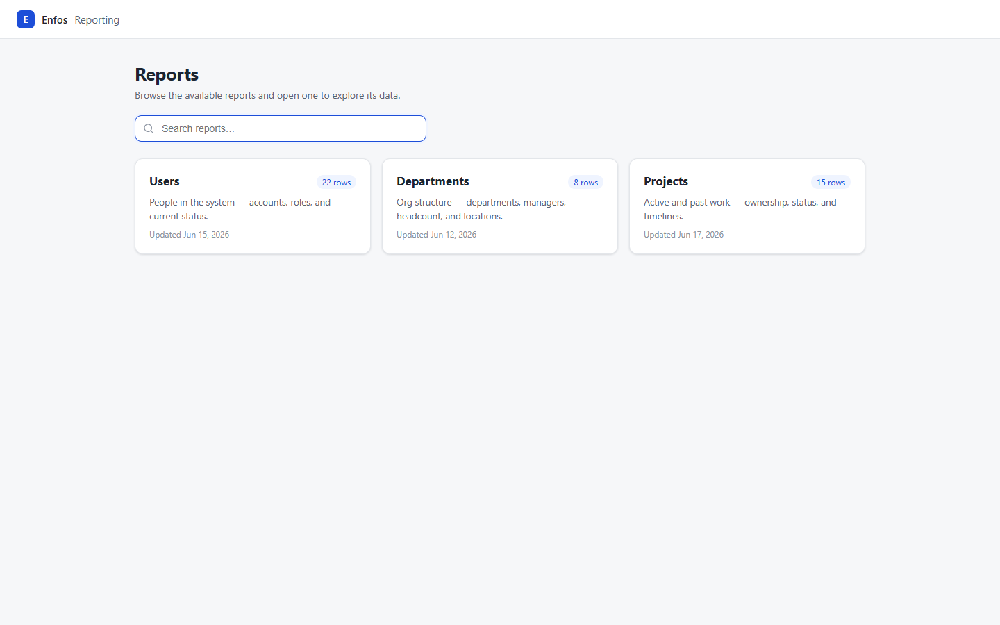

# Enfos Reporting Portal

A full-stack internal reporting portal: a React frontend backed by a Spring Boot
API. Users land on a reporting home, browse and search the available reports,
and open each one to explore its data in a sortable, filterable table.



## Run it (single command)

Prerequisite: **Docker Desktop** (Compose v2). Nothing else — the JDK, Maven,
and Node builds all happen inside the containers.

```bash
docker compose up --build
```

Then open **http://localhost:3000**.

The first build takes a few minutes (Maven and npm resolve dependencies inside
the images); later builds reuse cached layers. The backend container is not
published to the host — the only public port is 3000, and nginx proxies
`/api/*` to the API over the compose network.

To stop everything: `docker compose down`.

## Running the pieces directly (optional, for development)

Backend (needs JDK 21 + Maven):

```bash
cd backend
mvn spring-boot:run        # API on http://localhost:8080
```

Frontend (needs Node 18+):

```bash
cd frontend
npm install
npm run dev                # UI on http://localhost:5173, /api proxied to :8080
```

The Vite dev server proxies `/api` to `localhost:8080`, mirroring the nginx
setup in Docker, so there is no CORS configuration in either mode.

## API

| Method | Endpoint                    | Returns                             |
| ------ | --------------------------- | ----------------------------------- |
| GET    | `/api/reports`              | Report catalog (id, name, description, lastUpdated, rowCount, path) |
| GET    | `/api/reports/users`        | Users report rows                   |
| GET    | `/api/reports/departments`  | Departments report rows             |
| GET    | `/api/reports/projects`     | Projects report rows                |

The three row endpoints accept an optional `?delay=<ms>` (capped at 5s). Data
is in-memory, so responses are otherwise instant — the delay makes the loading
state reviewable, e.g. `http://localhost:3000/api/reports/users?delay=1500`.

Unknown report paths return **404**.

## Project layout

```
├── docker-compose.yml          # the single run command
├── backend/                    # Spring Boot 3 / Java 21
│   └── src/main/java/com/enfos/reporting/
│       ├── controller/         # REST endpoints
│       ├── service/            # report catalog + data access orchestration
│       ├── repository/         # ReportDataStore interface + in-memory impl
│       └── model/              # records: ReportMeta, UserRow, DepartmentRow, ProjectRow
└── frontend/                   # React 18 + Vite + TypeScript
    └── src/
        ├── pages/              # LandingPage, ReportPage
        ├── components/         # DataTable, SearchInput, StatusPill, AsyncStates
        ├── reports/            # reportConfig — column defs per report
        ├── hooks/              # useApi (fetch lifecycle: loading/error/success)
        └── api/                # response types
```

## Functionality checklist

- Browse all available reports on the landing page (cards show name,
  description, live row count, last updated)
- Search / filter reports by name
- Open a report and explore its data: column sorting (click a header) and a
  free-text filter across all columns
- Loading, error (with retry), and empty states on every data view
- Back navigation to the landing page; report URLs are deep-linkable
- Responsive from mobile widths up (cards stack; tables scroll horizontally)

## Tests

Backend API tests (endpoint contracts + 404 behavior) run with:

```bash
cd backend && mvn test
```

## Screenshots

See [docs/screenshots](docs/screenshots) — landing, search, tables, sorted
view, and the loading / empty / error states, plus mobile viewports.

## Assumptions & tradeoffs

- **In-memory data** (explicitly allowed): seeded, deterministic datasets so
  every run shows the same rows. The store sits behind a `ReportDataStore`
  interface, so a JDBC/JPA implementation can replace it without touching the
  service or controller.
- **Client-side sort and filter**: every report is well under 100 rows, so
  shipping all rows keeps interactions instant. With thousands of rows I would
  move sorting/filtering/pagination behind the API and add virtualization.
- **No query library / state manager**: all shared state is server data, held
  by a small `useApi` hook that handles aborts and retries. TanStack Query
  becomes worthwhile the moment caching or mutations appear; Redux isn't
  warranted for this shape of app.
- **Plain CSS with design tokens** rather than a component library: small
  surface area, no dependency weight, and it shows the styling work directly.
- **No auth**: an internal-tool slice per the brief; in production this would
  sit behind SSO and the API would enforce it.
